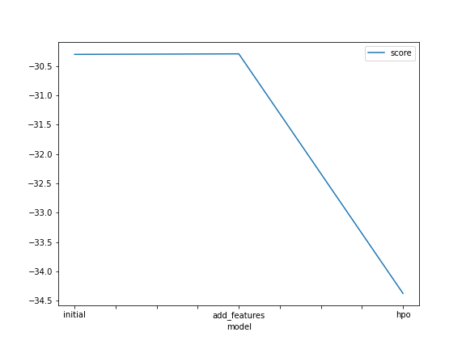
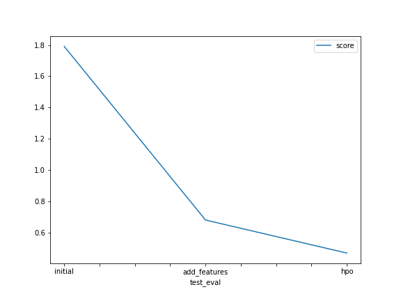

# Report: Predict Bike Sharing Demand with AutoGluon Solution
#### Ricard Santiago Raigada García

## Initial Training
### What did you realize when you tried to submit your predictions? What changes were needed to the output of the predictor to submit your results?

When I tried to submit my predictions, I realized that I needed to change the output format of the predictor to match the format required by the Kaggle competition. Specifically, the competition required my output file to have two columns: one for the record number and one for the predicted number of rented bikes for that record. I had to verify the provided CSV file to ensure I understood the required format. Additionally, the output file had to be in CSV format. Therefore, I had to adjust the predicted values to match the "count" column of the submission and create a valid CSV file for submission. At first, I was a little confused about whether to submit the evaluation command's result. After looking at the CSV, I understood that I needed to submit my predictions.

### What was the top ranked model that performed?

The best executed model has been WeightedEnsemble_L3, which is an ensemble-based model.

## Exploratory data analysis and feature creation
### What did the exploratory analysis find and how did you add additional features?
TODO: Add your explanation

### How much better did your model preform after adding additional features and why do you think that is?
TODO: Add your explanation

## Hyper parameter tuning
### How much better did your model preform after trying different hyper parameters?

I have seen that the variables temp and atemp are highly correlated. Similarly, the variables registered and count are highly correlated. The variables casual-count, casual-registered, atemp/temp-count/casual, and humidity-weather are also quite correlated. However, the variables count, registered, casual, windspeed have very low correlation with humidity. The distributions of registered, casual, windspeed, and count are left-skewed. Temp and atemp have approximately normal distributions. The samples of season are balanced, but not the samples of holiday and workingday.

### If you were given more time with this dataset, where do you think you would spend more time?
I would have invested more time in cleaning and preprocessing tasks. In hindsight, I have thought about several possible new features. Additionally, personally, I would have performed PCA to eliminate features that are not contributing to the model and would have standardized them. I might have required some axis rotation to better validate the data. On the other hand, I would have looked at which variables have contributed the most and the least from an initial model. Perhaps by removing some of them, the model's quality would improve.


```{Python}
def time_category(hour):
    if 7 <= hour <= 9:
        return 'morning'
    elif 13 <= hour <= 14:
        return 'lunch'
    elif 17 <= hour <= 18:
        return 'evening'
    else:
        return 'night'

# Create a new column 'time_category' based on the 'hours' column
train['time_category'] = train['hour'].apply(time_category)
test['time_category'] = test['hour'].apply(time_category)
train['time_category'] = train['time_category'].astype('category')
test['time_category'] = test['time_category'].astype('category')

# Define a function to map each temperature to the appropriate category
def temp_category(temp):
    if temp >= 25:
        return 'hot'
    elif temp <= 10:
        return 'cold'
    else:
        return 'mild'

# Create a new column 'temp_category' based on the 'temp' column
train['temp_category'] = train['temp'].apply(temp_category)
test['temp_category'] = test['temp'].apply(temp_category)
train['temp_category'] = train['temp_category'].astype('category')
test['temp_category'] = test['temp_category'].astype('category')

# Create a new column 'humidity_category' based on the 'humidity' column
def humidity_category(humidity):
    if humidity >= 60:
        return 'very humid'
    else:
        return 'not very humid'

train['humidity_category'] = train['humidity'].apply(humidity_category)
test['humidity_category'] = test['humidity'].apply(humidity_category)
train['humidity_category'] = train['humidity_category'].astype('category')
test['humidity_category'] = test['humidity_category'].astype('category')

def calculate_feels_like(temp, humidity):
    """Formula of the US National Weather Service to calculate the wind chill"""
    feels_like = 13.12 + 0.6215 * temp - 11.37 * humidity ** 0.16 + 0.3965 * temp * humidity ** 0.16
    return round(feels_like, 2)

train['feels_like'] = train.apply(lambda row: calculate_feels_like(row['temp'], row['humidity']), axis=1)
test['feels_like'] = test.apply(lambda row: calculate_feels_like(row['temp'], row['humidity']), axis=1)
```

### Create a table with the models you ran, the hyperparameters modified, and the kaggle score.
|model|hpo1|hpo2|hpo3|score|
|--|--|--|--|--|
|initial|default|default|default|1.79047|
|add_features|default|default|default|0.67905|
|hpo|hyperparameters_RF|hyperparameters_XGB|hyperparameter_stack_lvl|0.46763|
        
```{Python}
hyperparameters_RF = {'RF': {
        'criterion': Categorical('squared_error'),
        'max_depth': Int(lower=3, upper=30),
        'max_features': Real(lower=0.1, upper=1.0),
        'max_samples': Real(lower=0.1, upper=1.0)}}

hyperparameters_XGB = {'XGB': {
        'n_estimators': 100,
        'max_depth': Int(lower=3, upper=15),
        'learning_rate': Real(lower=1e-4, upper=1e-1, log=True),
        'subsample': Real(lower=0.5, upper=1.0),
        'colsample_bytree': Real(lower=0.1, upper=1.0),
        'num_boost_round': 100}}
    
hyperparameter_stack_lvl = 'num_stack_levels=2'
```

### Create a line plot showing the top model score for the three (or more) training runs during the project.




### Create a line plot showing the top kaggle score for the three (or more) prediction submissions during the project.




## Summary

In this report, I present my experience working with the bike rental dataset and AutoGluon to predict bike demand. When attempting to submit my predictions, I realized that I needed to change the output format of the predictor to match the format required by the Kaggle competition. The best-performing model was WeightedEnsemble_L3, which is an ensemble-based model. To improve the model's performance, I conducted exploratory data analysis and created new features such as the hour category, temperature category, and humidity category. I also performed hyperparameter optimization to improve the model's performance. If I had more time with this dataset, I would have invested more time in cleaning and preprocessing tasks and would have performed PCA to eliminate features that do not contribute to the model and standardize them. I would have also examined which variables have contributed most and least to an initial model to eliminate some of them and improve the model's quality. In summary, I took a series of steps to improve the model's performance and achieve a score of 0.46763 in the Kaggle competition.
